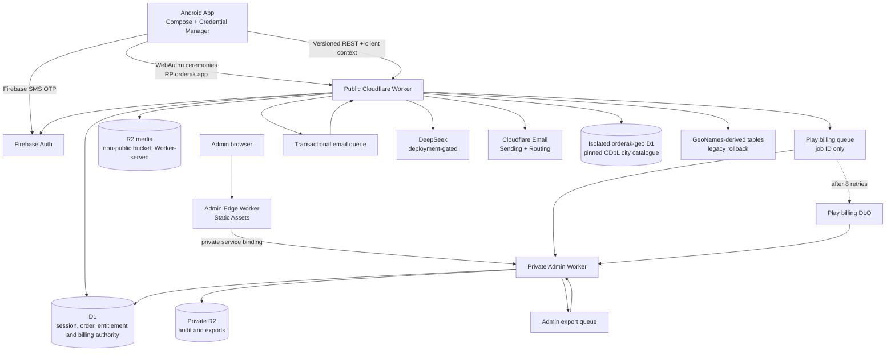

# Architecture Overview

> **Status:** Current repository architecture; inactive/future integrations are
> labeled explicitly
>
> **Last verified:** 2026-08-11

Orderak is a three-component system: an **Android seller app**, an
**Admin panel** (`apps/admin-web`, served by its own `orderak-admin-edge`
Worker — see [Admin control plane](#admin-control-plane) below), and a
**Cloudflare Workers backend**. This document previously described it as
two components, omitting the admin panel it goes on to document in detail
in the sections below — corrected here rather than left as an internal
contradiction.

iOS and seller Web/PWA are not implemented components. The current Android
codebase only maintains documented portability seams: versioned seller routes,
a platform-neutral client-context boundary, behavior-based auth contracts, and
explicit sync/conflict policy. See
[Cross-Platform Readiness Without Additional Clients](./cross-platform-readiness.md).

The version-controlled [interactive full architecture map](./orderak-full-architecture.html)
shows the Android, public API, private administration, storage, queue, billing,
AI, and external-provider boundaries together. It is internal engineering
documentation and is intentionally not published from the public Worker.

## Where the detail lives

This document maps components and the flows between them. **The business logic
inside each component is documented per domain**, and those pages are
authoritative on their own subject — where this overview and a domain page
disagree about a model, the domain page is right.

| Domain | Covers |
| --- | --- |
| [Identity](../domains/identity.md) | Accounts, authentication, device secrets, deletion, retention |
| [Stores](../domains/stores.md) | Store codes, slugs, public identifiers, resolution after rename |
| [Catalog](../domains/catalog.md) | Products, categories, translations, taxonomy, geo, public pages |
| [Orders](../domains/orders.md) | Order status machine and the public order endpoint's defences |
| [Billing](../domains/billing.md) | Payment gateways, Google Play verification, the billing gates |
| [Entitlements](../domains/entitlements.md) | Legacy plan limits, the v2 policy engine, usage reservation |
| [Growth](../domains/growth.md) | Ads, coupons, referrals |
| [Design system](../domains/design-system.md) | Token revisions, rollback, store theme, screen manifest |
| [Admin control plane](../domains/admin-control-plane.md) | The internal operations surface — 72% of the API |
| [Database topology](../data/database.md) | Databases, tenant routing, and the patterns D1 forces |

## Market portability

Orderak is architected for an **Egypt-first, MENA-next, global-later** rollout.
Egypt is the first production configuration, not a tenant or domain-model
boundary. Market activation remains gated: supporting a country in an ISO
picker or city catalogue does not make Orderak legally or operationally
available there.

The target market configuration separates:

- ISO country and subdivision/address rules;
- ISO 4217 currency, integer minor units, and currency fraction digits;
- timezone, language, and content locale;
- seller and buyer payment capabilities;
- tax, invoicing, legal-content, privacy, retention, and data-transfer rules;
- provider selection, feature availability, and release readiness.

Country-specific integrations belong behind Worker-owned configuration or
adapters; Android must never contain provider secrets. New shared code must not
introduce `EG`, EGP/piaster naming, InstaPay, Vodafone Cash, or Egyptian legal
rules as universal defaults.

This is a target architecture with partial implementation. ISO phone-country
support, country-scoped city data, global taxonomy, localized country names,
and country-bearing public identifiers are already portable. Money became
portable in migration `044_money_minor_units_with_currency.sql`, which renamed
the `*_piasters` columns to `*_minor` and added an explicit `currency` to every
table holding an amount. That migration is live in staging and **has not been
applied to production yet** — see
[schema skew](../data/database.md#staging-and-production-are-on-different-schemas-right-now).

What remains Egypt-specific: public catalog rendering still assumes EGP, payout
fields (InstaPay, Vodafone Cash) are Egyptian instruments, and there is no
country-capability or payment-method model. Those are the constraints to clear
before activating a second market.



## Hostnames

The public Worker and private admin delivery path split responsibilities:

| Hostname | Purpose | Auth required |
|----------|---------|:---:|
| `orderak.app` | Public landing page, store/category/product pages, media | No |
| `api.orderak.app` | Seller `/api/v1/*` and versioned external integrations; no legacy aliases | Per operation |
| `admin.orderak.app` | Admin Edge Worker serves static UI; API forwarded by service binding to the private Admin Worker | Yes (email + password + mandatory 2FA) |

## Environment isolation

Production and Staging run the same source revision through different deployment
configuration. Staging uses `*.staging.orderak.app`, distinct public/admin/edge
Workers, separate primary and geo D1 databases, separate R2 buckets, queues,
and a separate Firebase Android application.
No storage or session binding crosses the environment boundary.

Android's `stagingDebug` variant has application ID
`app.orderak.seller.staging` and calls only
`https://api.staging.orderak.app`; the Production flavor calls only
`https://api.orderak.app`. Production promotion uses the exact commit already
tested on Staging. Environment gates can disable a capability but cannot make
Staging data authoritative for Production.

## Design-system authority and delivery

D1 `design_system_revisions` stores immutable generated snapshots and
`design_system_state` stores the singleton active pointer. Applying performs
server-side generation/validation, inserts an unnamed candidate, conditionally
advances the pointer against `baseRevisionId`, and emits an audit event.
Optional unique names are mutable metadata only. Activating a historical
snapshot copies it into a new higher-ID checkpoint. Owners may physically
delete inactive revisions; rollback ancestry uses `ON DELETE SET NULL`, while
the active pointer prevents deletion of the current revision.

The public Worker serves additive schema-v2 JSON plus the old 14-token
projection, stable and hashed CSS endpoints, and self-hosted font assets.
Server-rendered landing, catalog, and legal pages inject active variables into
`<head>` to prevent FOUC. The admin edge proxies `/theme.css`; unsaved preview
tokens remain inside a restrictive-CSP iframe.

Android validates complete snapshots and writes downloads as
`pendingRevision`. The next foreground promotes the pending snapshot before a
new fetch. Compose maps colors, typography, shapes, spacing, extended semantic
colors, and the fixed 48dp component constraint without recoloring an active
interaction.

## Request flow

### Seller app → Backend

1. A valid cached server session routes directly to Main. Otherwise Android
   presents Welcome: a returning seller can invoke Credential Manager directly,
   while account creation/recovery requests Firebase SMS. A conditional phone
   fallback appears only when Passkeys are unavailable or fail; cancellation
   returns to Welcome. Phone and OTP are inline, the sent-to phone is locked,
   and explicit Verify is required after manual entry or SMS Autofill. OTP state
   remains phone-scoped and generation-checked.
2. Passkey assertions are verified by the Worker against a hash-only,
   single-use five-minute challenge, RP ID `orderak.app`, an approved Android
   APK origin, the signature, and required user verification. The platform
   performs biometrics locally; biometric data never crosses this boundary.
3. A new phone identity completes `POST /api/v1/auth/phone/complete`. An existing
   seller receives a normal device session. A new seller receives a hash-only
   onboarding session whose rolling lifetime is 30 minutes and absolute
   lifetime is 24 hours.
4. Account step 1 stores the private name, required birth year, optional email,
   and snapshots the published Terms/Privacy versions. Store step 2 atomically
   and idempotently creates the seller, store identity, organization,
   membership, route, legal evidence, and device session. Birth year remains in
   the private profile and never enters Store/public DTOs. Android's DataStore
   is only a resumable draft; D1 is the account/onboarding authority.
5. For ongoing requests, Android sends `x-orderak-phone` and `x-orderak-secret`
   (per-device credential) headers on every request. It also sends an opaque
   installation ID, user-visible device label, Android platform, and app version
   in optional headers so the credential can be identified and revoked.
6. Worker looks up the seller by phone, verifies the secret hash, and
   authenticates or rejects.
7. Authenticated requests flow to the appropriate handler: store info, product
   sync, order fetch, chat, media upload, billing.

The legacy `/api/v1/auth/session` plus `/api/v1/register` route remains unchanged for
rollback. Its earlier consent timing applies only to legacy clients.

### Public store pages

1. Browser requests `https://orderak.app/<public_identifier>`.
2. Worker parses the identifier into `{country_code, slug, store_code}`,
   resolves the store (falling back through `store_code` and legacy slug
   lookups), and renders an SEO-tagged HTML page.
3. Categories and products are nested under the store: `/<pid>/c/<category_code>`
   and `/<pid>/p/<product_code>`.
4. No auth required. No internal UUIDs or authentication phone number appears
   as an identifier. Seller-supplied WhatsApp/contact details may appear in the
   HTML by design, and payout/contact details are returned after a successful
   public order.

### Admin panel

1. Admin signs in at `https://admin.orderak.app` with email + password.
2. The private Admin Worker sets an HttpOnly, `SameSite=Strict` opaque session
   cookie; only its hash and server-side expiry/revocation state are stored in D1.
3. The Admin Edge Worker forwards `/api/admin/v1/*` through a private service
   binding. The Admin Worker resolves the D1 session, validates CSRF/origin
   posture, and checks RBAC.
4. TOTP 2FA is mandatory before a control-plane session is issued.

## Data sync

```mermaid
sequenceDiagram
    participant Room as Room DB (Android)
    participant WM as WorkManager
    participant App as Android App
    participant Worker as Cloudflare Worker
    participant D1 as D1 Database

    App->>WM: Enqueue periodic sync (15 min)
    WM->>Worker: GET /api/v1/orders?since=<last_order_no> (repeat while has_more)
    Worker->>D1: SELECT orders WHERE order_no > since
    D1-->>Worker: New orders
    Worker-->>WM: { orders: [...] }
    WM->>Room: Insert/update orders
    App->>WM: On-demand sync (foreground/manual)
    WM->>Worker: POST /api/v1/products/sync (stock_dirty + expected_stock_version)
    Worker->>D1: Mirror metadata; compare-and-set explicit stock edits
    D1-->>Worker: Confirmed
    Worker-->>WM: Product identity + authoritative stock revision
    WM->>Room: Update codes, UUIDs, stock revisions
```

- **Room** is the local operational cache/source for the offline Android UI;
  D1 remains authoritative for account creation, store identity, authentication,
  billing, and accepted legal versions.
- **WorkManager** runs periodic sync (15-minute cadence) plus on-demand
  foreground/manual sync.
- Orders are pulled by paginated cursor (`order_no`). Product metadata is
  mirrored; existing inventory uses optimistic revisions.

## Backend structure

The Worker is a modular monolith (`services/backend/src/entrypoints/public-worker.ts` is the top-level
router). Concerns are split into:

| Module | File(s) | Responsibility |
|--------|---------|---------------|
| Entrypoints | `entrypoints/public-worker.ts`, `entrypoints/admin-worker.ts` | Public/seller and admin trust boundaries |
| Identity | `domains/identity/*` | OTP, onboarding, Passkeys, sessions, deletion, and retention |
| Stores | `domains/stores/api-store.ts` | Registration, store information, categories, and product sync |
| Catalog | `domains/catalog/*` | Public catalog, geography, taxonomy, and translations |
| Commerce | `domains/commerce/*` | Billing, entitlements, payments, plans, and ads |
| Design | `domains/design/*` | Theme, design-system revision, and screen-manifest authority |
| Operations | `domains/operations/*` | Seller operations and capability evaluation |
| Platform | `platform/*` | HTTP, config, localization, jobs, resilience, storage, and tenancy |
| Admin | `domains/admin/*` | RBAC-protected administration and control-plane behavior |
| Integrations | `integrations/*` | DeepSeek, Cloudflare Email, and Google Play adapters |

## Key design decisions

- **UUID primary keys** are never exposed in URLs. Public identifiers
  (`store_code`, `product_code`, `category_code`) are immutable.
- **Integer minor units** for all money — no floating-point, and never an
  amount without its currency. Money columns are `*_minor` with an explicit
  ISO 4217 `currency`, applied by migration
  `044_money_minor_units_with_currency.sql`.
- **Mirror metadata + optimistic stock sync** — existing stock changes only for
  an explicit dirty edit whose server revision matches. Public orders claim
  stock atomically and advance the revision, preventing stale-device lost updates.
- **Cursor sync** for orders — the app pulls only orders newer than its last
  known `order_no`, following 50-row pages until `has_more=false`.
- Android calls only the Worker for network application data. Registration
  requests no GPS permission. City suggestions come from the Worker-owned
  static catalogue in isolated `orderak-geo` D1; the verified phone country is
  authoritative. Manual entry is the user fallback and GeoNames remains the
  operational rollback path.
- **Idempotency keys** on payment operations prevent double-charging on retry.
- **Fail-closed launch flags** keep paid acquisition and seller AI unavailable
  unless `BILLING_ENABLED` or `AI_ASSISTANT_ENABLED` is exactly `true`. The
  production baseline sets both to `false`; an approved change and downstream
  evidence gate are required before deployment with either enabled.
- **Fail-closed auth flags** keep the additive onboarding and Passkey routes
  inactive until migrations, legal publication, Asset Links, Firebase regional
  policy, static city import, staging tests, and physical-device evidence exist.
  `ONBOARDING_ENABLED=false` and `PASSKEY_ENABLED=false` are the checked-in
  baseline and legacy OTP remains the rollback path.

See the [architecture decision records](../decisions/adr-001-cloudflare-workers-d1.md)
for the reasoning behind major technical choices.

## Operations surfaces

`domains/operations/seller-operations.ts` provides seller-scoped support, announcements,
translation lifecycle, device management, deletion status, and account status.
`domains/admin/admin-operations.ts` provides the corresponding RBAC-gated operations console,
plus subscription inspection, job observability/manual owner runs, and typed
effective runtime controls. Scheduled retention, deletion, and Play
reconciliation executions are recorded through `platform/jobs/operational-jobs.ts`.

Account status is enforced in the top-level authenticated API path. A
non-active seller receives the stable `account_restricted` error for normal
operations while account and deletion status stay available. Android performs
a bounded status check through one entry gate used by launch, login, completed
setup, restriction recheck, logout, and mid-session invalidation. The gate reads
one atomic DataStore profile snapshot, distinguishes pre-registration from a
registered credential, prioritizes confirmed or cached restriction over setup,
and retains cached setup/Main access when status refresh is unavailable. Stable
credentialed `401 auth` and `403 account_restricted` responses publish a
sanitized in-process signal that re-enters the gate; backend authorization
remains the enforcement boundary.

Machine or reviewed translations may render publicly. Rejected and stale rows
fall back to seller-authored content. First-party ads are authenticated,
plan-targeted, schedule-filtered, localized, restricted to HTTPS destinations,
and tracked with optional client event-key idempotency.

## Subscription policy engine

The seller belongs to an `organization`, and each organization resolves one
effective immutable plan revision plus active organization overrides. A typed
entitlement definition describes value type, unit, reset period, implementation
status, enforcement binding, and whether an administrator may change it. Usage
counters and idempotent reservations enforce monthly order and AI limits at the
write boundary; category insertion is conditional and product mirror size is
checked before writes. Device admission uses the same resolved snapshot.

The Android app treats the Worker snapshot as the only access authority. Google
Play supplies localized product details and purchase tokens. Direct verification,
RTDN, reconciliation, and admin retry all create the same encrypted D1 job and
run through `verifyAndApplyPlayPurchase()`. Queue messages contain only a job ID.
An organization-scoped generation and D1 triggers prevent an older provider
response from overwriting a newer result. State commits before acknowledgement;
RTDN is a hint only and every lifecycle event re-queries Google. The D1 outbox is
swept each minute, exhausted retries enter a separate DLQ, and audited admin
requeue never exposes the raw token.

`BILLING_ENABLED` controls acquisition only.
`GOOGLE_PLAY_LIFECYCLE_ENABLED` independently controls verification, RTDN,
restore, reconciliation, and acknowledgement. After the first payer exists,
rollback disables acquisition while lifecycle processing remains enabled.

Queue delivery is at-least-once. One atomic `UPDATE … RETURNING` grants a
120-second claim covering OAuth, re-query, acknowledgement, and D1 margin.
Active duplicates are acknowledged without a provider call; expired claims are
reclaimable. Every job-state write is token-gated and organization generations
protect entitlement state. A zombie Worker can still duplicate a non-charging
Google verification/acknowledgement call after expiry; reclaim frequency and
claim-duration percentiles are operational signals.

## Stable identity and tenant routing

The stable chain is Firebase subject + verified E.164 identity → seller →
organization → immutable Play account hash. `sellers.phone/firebase_uid` remain
synchronized rollback projections while `AUTH_IDENTITY_ENABLED` controls
the read cutover. Registration creates the seller, identity, organization,
primary membership, `organization_routing` row, and Play hash atomically.
Phone change is backend-only and disabled by default; successful completion
preserves every organization and billing link.

All organizations currently route through `TenantContext` to the single
`orderak_db` primary. Tenant write fences return a stable retryable 503. No
seller/public request performs synchronous fan-out. Cross-organization exports
and maintenance become queued scans; dashboards use summaries and real-time
uniqueness/security/provider budgets remain compact global ledgers. See
[ADR-007](../decisions/adr-007-shard-ready-single-d1.md) and the versioned
[migration runbook](../runbooks/tenant-shard-migration.md).

`EntitlementRepository` is the Android single source of truth for plan UI. It
loads an account-scoped DataStore snapshot immediately, publishes reactive
Compose state through `EntitlementManager`, and revalidates the compact
`android-v1` projection with `If-None-Match`. Foreground entry, pull-to-refresh,
periodic/on-demand sync, and verified purchases all converge on that repository.
The cache guides UI while authenticated Worker write endpoints remain the final
enforcement boundary. A failed refresh retains cached decisions and marks them
offline; logout clears the cache before the account session is removed.

Published plan revisions are immutable. Administrators edit drafts, validate
the tier ladder, preview impact, and publish. The current revision applies to
new purchases; restrictive paid changes are pending until renewal.

## Admin control plane

`apps/admin-web/` is the only admin presentation layer. The
`orderak-admin-edge` Worker maps `admin.orderak.app`, serves the compiled React
application with Workers Static Assets, and forwards only `/api/admin/v1/*`
over the `ADMIN_WORKER` service binding. It has no D1, R2, KV, or provider
secret bindings. This removes the extra Pages-origin hop while preserving the
private Admin Worker boundary.
`services/backend/src/entrypoints/admin-worker.ts` mounts the API-only router, queue consumer, and
audit-archive scheduler. The public Android/API Worker mounts seller/public
APIs only and cannot serve admin HTML or admin API routes.

D1 stores opaque sessions, RBAC state, control definitions, targeting rules,
security alerts, export metadata, and audit-chain checkpoints. Private R2 stores
export artifacts and hash-chained audit batches. Environment variables remain
the top-level hard gates; the shared configuration evaluator applies version,
trust, plan, store, targeting, and deterministic rollout rules before exposing
an effective decision to Android or runtime consumers.
